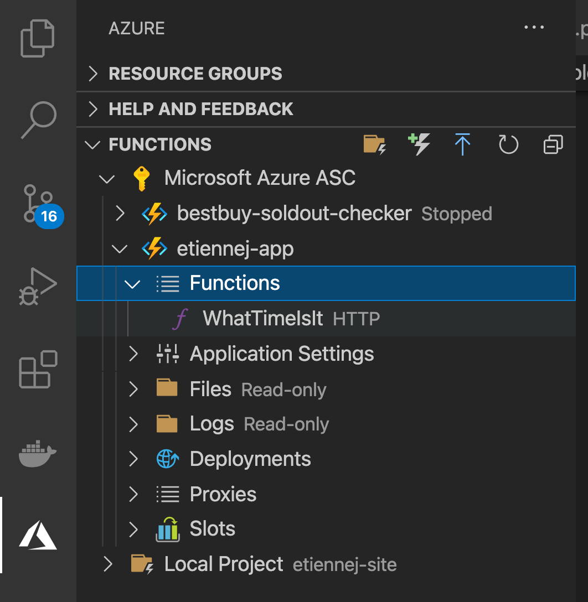

# Simple Azure Function example to print the time ⌚

This example uses my new & dedicated Azure Function endpoint on ASC UPenn Azure dashboard 

🚀 --> [https://etiennej-app.azurewebsites.net/](https://etiennej-app.azurewebsites.net/) 

## Getting Started

This Azure Function App contains a project directory [etiennej-site/WhatTimeIsIt](./WhatTimeIsIt)
- This example very simple sets our `HTTPResponse` value to include datetime.now() current time information.

 


### Config Files for Azure Function Python HTTP:

Edit the Python script for our HTTP Response:

#### Edit the config file [etiennej-site/WhatTimeIsIt/__init__.py](./WhatTimeIsIt/__init__.py)


- add modules you need:

``` diff
import azure.functions as func
+ from datetime import datetime
```

- add object (your python code of interest) to main function of python script:

``` diff
def main(req: func.HttpRequest) -> func.HttpResponse:
+    current_time = datetime.now().strftime("%H:%M:%S %D")
```

- edit the HttpResponse to include your current_time value:

``` diff
return func.HttpResponse(
+            "This HTTP triggered function executed successfully.\n\n Current time of http trigger --> {}.".format(current_time),
```

- This also has our [requirements.txt](./etiennej-site/requirements.txt) for pip installs for a function, of course not need in this simple example...

______


## Deploy on Local for Test & Dev app *WhatTimeIsIt*

In Visual Studio Code, open (cmd+o) into the **Local Function project directory** and on your keyboard enter (fn)`f5` to run the local function as:

- [http://localhost:7071/api/WhatTimeIsIt](http://localhost:7071/api/WhatTimeIsIt)


_____

## Deploy an Azure Function App w/ Visual Studio Code on MacOS:

You can pre-create on Azure portal dashboard or create via Visual Studio Code GUI (*would be nice to see the corresponding azcli commands!*) for the new function app. 

- We select my default ASC developer Azure credentials with region `us-east-2` (*is that a different time zone? that doesn't seem right but my time returned is off by like 4+ hours or something, I got 02:41:37 03/31/21 at 10:41PM on 03/30?!?*)

Your Function app is available online here: 

- [https://etiennej-app.azurewebsites.net/api/whattimeisit](https://etiennej-app.azurewebsites.net/api/whattimeisit)

Go ahead and get the time result:

``` bash
curl https://etiennej-app.azurewebsites.net/api/whattimeisit
```

______ 

## *So you've deployed your Azure Function app... Now what?*

- This is just a super simple example, you can then `curl` from a python jhub notebook to get the time & date for httptrigger... many other real-time actions can be accomplished like this!

